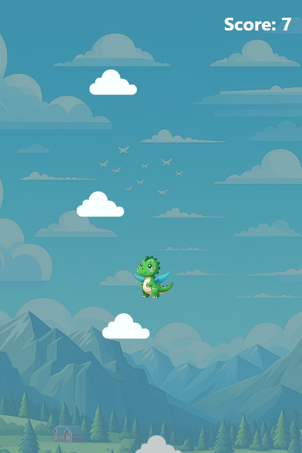

# Dino Jump

 

  A screenshot of the gameplay.

## Introduction

Dino Jump is an exciting, fast-paced platformer game where you control a cute dinosaur character jumping from cloud to cloud. Test your reflexes and see how high you can climb! This game is developed using React and TypeScript, with the assistance of Claude 3.5 Sonnet, an AI language model by Anthropic.

## Gameplay Instructions

1. **Objective** : Jump from cloud to cloud, climbing as high as you can while avoiding falls.
2. **Controls** :

* Use the **Left Arrow** key to move left
* Use the **Right Arrow** key to move right
* Press **Spacebar** to start the game or restart after game over

3. **Scoring** : Each successful jump to a new cloud increases your score by 1 point.
4. **Game Over** : The game ends when you fall off the bottom of the screen.

## Installation

To run Dino Jump on your local machine, follow these steps:

1. Ensure you have [Node.js](https://nodejs.org/) (version 12 or higher) and npm installed on your computer.
2. Clone the repository:
   <pre>

<button class="flex flex-row items-center gap-1 rounded-md p-1 py-0.5 text-xs transition-opacity delay-100 hover:bg-bg-200"><svg xmlns="http://www.w3.org/2000/svg" width="14" height="14" fill="currentColor" viewBox="0 0 256 256" class="text-text-500 mr-px -translate-y-[0.5px]"><path d="M200,32H163.74a47.92,47.92,0,0,0-71.48,0H56A16,16,0,0,0,40,48V216a16,16,0,0,0,16,16H200a16,16,0,0,0,16-16V48A16,16,0,0,0,200,32Zm-72,0a32,32,0,0,1,32,32H96A32,32,0,0,1,128,32Zm72,184H56V48H82.75A47.93,47.93,0,0,0,80,64v8a8,8,0,0,0,8,8h80a8,8,0,0,0,8-8V64a47.93,47.93,0,0,0-2.75-16H200Z"></path></svg>Copy</button>

<code>git clone https://github.com/your-username/dino-jump.git</code>

</pre>
3. Navigate to the project directory:
   <pre>

<button class="flex flex-row items-center gap-1 rounded-md p-1 py-0.5 text-xs transition-opacity delay-100 hover:bg-bg-200"><svg xmlns="http://www.w3.org/2000/svg" width="14" height="14" fill="currentColor" viewBox="0 0 256 256" class="text-text-500 mr-px -translate-y-[0.5px]"><path d="M200,32H163.74a47.92,47.92,0,0,0-71.48,0H56A16,16,0,0,0,40,48V216a16,16,0,0,0,16,16H200a16,16,0,0,0,16-16V48A16,16,0,0,0,200,32Zm-72,0a32,32,0,0,1,32,32H96A32,32,0,0,1,128,32Zm72,184H56V48H82.75A47.93,47.93,0,0,0,80,64v8a8,8,0,0,0,8,8h80a8,8,0,0,0,8-8V64a47.93,47.93,0,0,0-2.75-16H200Z"></path></svg>Copy</button>

<code>cd dino-jump</code>

</pre>
4. Install the dependencies:
   <pre>

<button class="flex flex-row items-center gap-1 rounded-md p-1 py-0.5 text-xs transition-opacity delay-100 hover:bg-bg-200"><svg xmlns="http://www.w3.org/2000/svg" width="14" height="14" fill="currentColor" viewBox="0 0 256 256" class="text-text-500 mr-px -translate-y-[0.5px]"><path d="M200,32H163.74a47.92,47.92,0,0,0-71.48,0H56A16,16,0,0,0,40,48V216a16,16,0,0,0,16,16H200a16,16,0,0,0,16-16V48A16,16,0,0,0,200,32Zm-72,0a32,32,0,0,1,32,32H96A32,32,0,0,1,128,32Zm72,184H56V48H82.75A47.93,47.93,0,0,0,80,64v8a8,8,0,0,0,8,8h80a8,8,0,0,0,8-8V64a47.93,47.93,0,0,0-2.75-16H200Z"></path></svg>Copy</button>

<code>npm install</code>

</pre>

## Running the Game

After installation, you can run the game using the following command:

<pre>

<button class="flex flex-row items-center gap-1 rounded-md p-1 py-0.5 text-xs transition-opacity delay-100 hover:bg-bg-200"><svg xmlns="http://www.w3.org/2000/svg" width="14" height="14" fill="currentColor" viewBox="0 0 256 256" class="text-text-500 mr-px -translate-y-[0.5px]"><path d="M200,32H163.74a47.92,47.92,0,0,0-71.48,0H56A16,16,0,0,0,40,48V216a16,16,0,0,0,16,16H200a16,16,0,0,0,16-16V48A16,16,0,0,0,200,32Zm-72,0a32,32,0,0,1,32,32H96A32,32,0,0,1,128,32Zm72,184H56V48H82.75A47.93,47.93,0,0,0,80,64v8a8,8,0,0,0,8,8h80a8,8,0,0,0,8-8V64a47.93,47.93,0,0,0-2.75-16H200Z"></path></svg>Copy</button>

<code>npm start</code>

</pre>

This will start the development server. Open your web browser and go to `http://localhost:3000` to play the game.

## Technologies Used

* React
* TypeScript
* HTML5 Canvas
* CSS3 (with Tailwind CSS)

## Contributing

We welcome contributions to Dino Jump! If you have suggestions for improvements or bug fixes, please open an issue or submit a pull request.

## Acknowledgments

* Game concept inspired by classic platformer games
* Developed with the assistance of Claude 3.5 Sonnet, an AI language model by Anthropic
* Special thanks to all contributors and testers

Enjoy playing Dino Jump!
